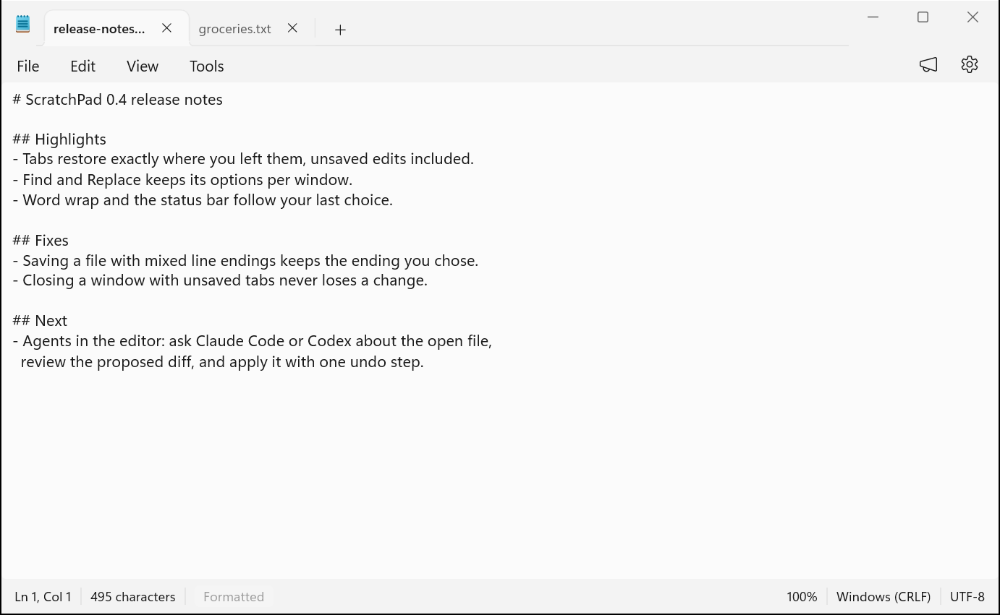

# ScratchPad

Windows 11 Notepad, exact down to the status bar, plus your own AI agents (Claude Code and Codex) beside the editor, with no subscription nag.

[](https://github.com/rizonesoft/ScratchPad/actions/workflows/build.yml)
[](https://github.com/rizonesoft/ScratchPad/actions/workflows/plan.yml)
[](https://github.com/rizonesoft/ScratchPad/actions/workflows/soak.yml)
[](LICENSE)
[](global.json)
[](docs/bootstrap.md)



## Who it is for

People who live in Notepad and already pay for an AI agent: you want the editor you know, tab for tab and menu for menu, and you want the agent you already have to work inside it, on your machine, with your keys.

What it does today, and what is on the way:

- **Notepad, 1:1.** Tabs and windows, menus, find and replace, go to, word wrap, zoom, fonts, encodings and line endings, Markdown tabs, a live status bar, and a settings page, reproduced in C# and WinUI 3 against captured Windows 11 Notepad behavior (printing is still in progress).
- **A few extras.** Tools carries document statistics, snapshots, templates, export, and file locking.
- **Nothing lost.** Tabs restore exactly where you left them, unsaved edits included, and closing a window never discards a change.
- **Encrypted notes.** A note can carry a password; the file format is documented in [docs/encrypted-notes.md](docs/encrypted-notes.md).
- **Agents beside the editor (in development).** A panel where Claude Code and Codex answer about the open document through the open [Agent Client Protocol](https://agentclientprotocol.com/get-started/agents). Every agent action asks first, every edit arrives as a diff you review, and applying it is one undo step. The panel is not in the app yet; its sections live under `todo/03-acp-client/`, `todo/04-agents/`, and `todo/05-ai-surface/`.

## Quick start

Windows 11 with git, Windows PowerShell 5.1 (inbox), and Python 3 on PATH. Run every command from the repository root (the folder the clone creates).

```powershell
git clone https://github.com/rizonesoft/ScratchPad.git
cd ScratchPad
powershell -ExecutionPolicy Bypass -File tools\provision.ps1
$env:DOTNET_ROOT = "$PWD\.tools\dotnet-win-x64"; $env:PATH = "$PWD\.tools\dotnet-win-x64;" + $env:PATH; $env:DOTNET_MULTILEVEL_LOOKUP = "0"
dotnet build src/ScratchPad.slnx
# Once per machine: the app needs the Windows App Runtime 2.x. If this prints nothing, install it:
Get-AppxPackage -Name 'Microsoft.WindowsAppRuntime.2*' | Select-Object -First 1 Name, Version
Invoke-WebRequest https://aka.ms/windowsappsdk/2.4/2.4.0/windowsappruntimeinstall-x64.exe -OutFile "$env:TEMP\windowsappruntimeinstall-x64.exe"; & "$env:TEMP\windowsappruntimeinstall-x64.exe"
py tools/launch.py
```

The provisioner installs the pinned .NET SDK into `.tools/` inside the checkout (never machine-wide) and wires the git hooks. The build puts the app at `Bin\ScratchPad\Debug\win-x64\ScratchPad.exe`, and `tools/launch.py` starts it. The runtime check runs once per machine; skip the install line when the check prints a package. For a fast test pass without the UI suites, run `dotnet test src/Notepad.Neutral.slnf`; `dotnet test src/ScratchPad.slnx` runs everything, including UI automation that drives real windows. [docs/bootstrap.md](docs/bootstrap.md) walks through each step.

## Configuration

ScratchPad is a desktop app: there are no environment variables to set and no `.env` file, because it reads no secrets and talks to no service of its own. Settings live in the app (the gear at the top right, or Settings in the menu) and persist to `%LocalAppData%\ScratchPad\settings.json`; the schema is in [docs/settings-schema.md](docs/settings-schema.md). Agent sign-in, when the panel lands, goes through each agent's own login and the Windows credential store, never a file in this repository.

## Usage

- **Open:** File, Open (Ctrl+O), or Recent; each file opens in its own tab (File, New tab is Ctrl+N).
- **Edit:** type as in Notepad; Edit carries Find (Ctrl+F), Replace (Ctrl+H), Go To (Ctrl+G), and Time/Date (F5); View toggles word wrap, zoom, and the status bar.
- **Save:** File, Save (Ctrl+S), Save as (Ctrl+Shift+S), or Save all; the status bar shows the encoding and line endings the file saves with.
- **Pick up where you left off:** close the window with unsaved tabs and reopen ScratchPad; every tab comes back as it was.
- **Agent panel:** in development (see Who it is for); nothing in the app talks to an agent yet.

## Troubleshooting

- **`dotnet build` says a compatible .NET SDK was not found.** The shell resolved a machine SDK, and `global.json` accepts only 10.0.400. Run the `$env:DOTNET_ROOT = ...` line from the quick start in the same shell, then check `dotnet --info` lists the SDK under your checkout's `.tools\` folder. Never install an SDK by hand to fix this.
- **The provisioner fails with `WSL UtilBindVsockAnyPort: socket failed 1`.** You ran it through WSL interop. Run `powershell -ExecutionPolicy Bypass -File tools\provision.ps1` from Windows PowerShell directly.
- **The app does not start after a green build.** The Windows App Runtime 2.x is missing. Check with `Get-AppxPackage -Name '*WindowsAppRuntime*'` and install it from `https://aka.ms/windowsappsdk/2.4/2.4.0/windowsappruntimeinstall-x64.exe`.
- **A commit is refused with a TODO validation error.** The pre-commit hook runs `py scripts/todo-graph.py validate` on the staged tree. Run that command, fix what it names, and commit again; if the hook never ran at all, wire it once with `git config core.hooksPath tools/githooks`.
- **The build fails on a warning.** Warnings are errors everywhere (`Directory.Build.props`). Run `dotnet build src/ScratchPad.slnx` locally to see the same analyzer message CI saw, and fix the code it names.

## Why this exists

Somewhere along the way, the humble text editor learned a new trick: asking for money. You highlight a paragraph, click Rewrite, and instead of better prose you get a message explaining that intelligence costs $10 a month, billed annually, terms and conditions apply, have you tried turning your wallet off and on again.

ScratchPad (first called Intelligent Notepad) is built on a contrarian belief: that the AI subscription you already have should work in the text editor you already use. No Microsoft account sign-in to summarize a grocery list. No AI credits deducted because you dared to rephrase a sentence. No Copilot+ PC required to fix a typo with anything smarter than hope.

Just Notepad. Every tab, every menu, every pixel of the status bar, reproduced 1:1 in C# and WinUI 3 on .NET. And sitting beside it, a panel where Claude Code and Codex do the thinking, reached through the open Agent Client Protocol. Your agents, your keys, your machine. The paywall is not included, because there isn't one.

Design authority is split exactly two ways: Windows 11 Notepad dictates the editor, and the Agent Client Protocol specification dictates the agent layer. Microsoft's [Intelligent Terminal](https://github.com/microsoft/intelligent-terminal) proved that ACP fits inside a native desktop app, and it is cited in the plan as prior art for that lesson only. Nothing here is designed to match it: the context is your document, never a shell, and nobody suggests running `rm -rf` anything.

## What it is not

It is not a terminal, and it is not designed like one. Nothing here runs shell commands, detects failed builds, or knows what a TTY is. The agent chrome (status bar, pane, sessions, slash commands) solves editor problems for documents; any resemblance to terminal agent UX ends at "both talk ACP". If you came looking for a command line with opinions, that project is excellent and it lives next door.

It is not Word. There will be no paperclip, no mail merge, and no Clippy resurrection arc, no matter how politely you ask.

It is not a subscription. Saying it twice because it bears repeating.

## Layout

| Path | What it is |
| ---- | ---------- |
| `src/` | The app (WinUI 3 shell plus editor, ACP, agents) |
| `tests/` | Unit, smoke, UI, and protocol suites (backbone: `D00 T02`) |
| `resources/baseline/` | Captured Notepad baseline for parity checks |
| `todo/` | The live execution plan. Start here. |
| `scripts/` | The TODO graph (`todo-graph.py`, stdlib-only) and the review tooling (`review_prompt.py`, `panel_slots.py`, `probe_runner.py`) |
| `tools/` | Provisioning, launch, the governed nightly and its reconcilers, and the README capture |
| `docs/` | Guides, procedures, ledgers, review records, and phase runs |
| `.claude/` | Claude Code skills and hooks that run the plan |
| `.conclave/` | The review panel's slot wiring (`panel.toml`) |
| `.github/` | CI workflows, issue and pull request templates |

Build output lands under `Bin/`, `build/`, and `TestResults/`, all gitignored.

## Toolchain pins

Exact versions, verified 2026-09-13 against the .NET release metadata and NuGet. Nothing here floats.

| Component | Version | Pinned in |
| --------- | ------- | --------- |
| .NET SDK | 10.0.400 (runtime 10.0.11; SDK row re-verified 2026-09-19) | `global.json` (`rollForward: disable`) |
| Windows App SDK | 2.4.0 | `src/ScratchPad/packages.lock.json` |
| xunit | 2.9.3 | `tests/Smoke/packages.lock.json` |
| xunit.runner.visualstudio | 2.8.2 | `tests/Smoke/packages.lock.json` |
| Microsoft.NET.Test.Sdk | 17.14.1 | `tests/Smoke/packages.lock.json` |

`tools/provision.ps1` reads the SDK version from `global.json`, downloads that exact build from `builds.dotnet.microsoft.com`, verifies its published SHA512 (win-x64 `9b8b8859…8c366`; full hashes in the [release metadata](https://builds.dotnet.microsoft.com/dotnet/release-metadata/10.0/releases.json)), and extracts into repo-local `.tools/dotnet-win-x64/`. No machine-wide install, no build step reads outside the repo.

The xunit v2 line is pinned, reversing the §1 v3 default: v3 on MTP (`xunit.v3.mtp-v2` 4.0.1 + MTP 2.4.0 + SDK 10.0.401) discovers zero tests under `dotnet test`, proven on our project and on xunit's own official template alike, while the v2 VSTest stack passes first try. T02 §1 re-evaluates v3/MTP when the ecosystem heals.

## How the work is planned

1. `todo/TODO-00-INDEX.md` -- domain order and active work.
2. `todo/implementation-plan.md` -- every section in dependency order, grouped in phases.
3. `todo/README.md` -- the format spec: sections, stamps, XREFs, gates.
4. `AGENTS.md` -- working rules.

```powershell
py scripts/todo-graph.py validate       # structural and graph integrity of todo/
py scripts/todo-graph.py query ready    # sections whose dependencies are met
py scripts/todo-graph.py resolve 'D00 T01 §1'   # any section reference -> file, section, deps, status
```

Only the ACP client talks to agents, over JSON-RPC 2.0 on stdio: the client launches the agent subprocess (Codex via `codex-acp`, Claude via `claude-agent-acp`), negotiates versions, and drives sessions. Every agent action is consent-gated (`D03 T02`, `D05 T02`); every agent edit is reviewed as a diff and applied through undo (`D05 T02 §3-§4`). The agent can suggest; only you can commit.

The TODO system (graph script, format, skills, plan mechanics) is a day-1 port of the JMR Online TODO system, seeded 2026-09-14 and groomed against real Windows 11 Notepad behavior the same week. History comments in the scripts name JMR sections (`D00 T01 §21` and the like): those are provenance for why a rule exists, not live references here.

### Deferred

Ported deliberately later, when the repo earns them:

- `plan-gate.py` (routing authority with host probes and clock parks): `query ready` plus the phase tables route until then.
- `section_commit_gate.py` (stamp provenance at commit time): `validate` plus review carry the contract until then.
- `coming-soon-inspect.py`: the `pending-control-contract` severity class stays reserved until it lands.

## Documentation

| Document | What it covers |
| --- | --- |
| [docs/bootstrap.md](docs/bootstrap.md) | From a fresh clone to a green build and test run, with troubleshooting |
| [docs/build.md](docs/build.md) | Build, clean, test, analysis, and launch commands |
| [docs/testing.md](docs/testing.md) | The test suites, the governed nightly, and its notification contracts |
| [docs/settings-schema.md](docs/settings-schema.md) | The settings store and every setting |
| [docs/encrypted-notes.md](docs/encrypted-notes.md) | The encrypted note file format |
| [docs/soak-and-quarantine.md](docs/soak-and-quarantine.md) | How flaky tests are soaked and quarantined instead of deleted |
| [docs/ui-automation-spike.md](docs/ui-automation-spike.md) | The UI automation driver decision |
| [docs/ui-input-audit.md](docs/ui-input-audit.md) | The audit of focus-dependent UI test input |
| [docs/incident-ledger.md](docs/incident-ledger.md), [docs/incident-links.md](docs/incident-links.md) | Nightly incident identity and triage links |
| [docs/nightly-exclusions.md](docs/nightly-exclusions.md), [docs/nightly-host-aliases.md](docs/nightly-host-aliases.md), [docs/nightly-pauses.md](docs/nightly-pauses.md), [docs/nightly-schedule-history.md](docs/nightly-schedule-history.md) | Operator ledgers the nightly trend reads |
| [docs/owed-case-retirements.md](docs/owed-case-retirements.md), [docs/test-exclusions.md](docs/test-exclusions.md) | Test population ledgers |
| [docs/risk-register.md](docs/risk-register.md) | Accepted risks with residual severity |
| [docs/assets/captures.md](docs/assets/captures.md) | Provenance for every screenshot in this README |

## Contributing

Read [CONTRIBUTING.md](CONTRIBUTING.md): where the work lives, the one-command build, and the gates every change passes. Bugs and ideas go through the issue templates.

## Status and license

Active development, pre-release: the Notepad surface is being built section by section against captured Windows behavior, and the agent panel is not in the app yet. Expect breaking changes and no installer until the release domain (`todo/07-release/`) ships.

Licensed under the GNU General Public License v3.0: see [LICENSE](LICENSE).
